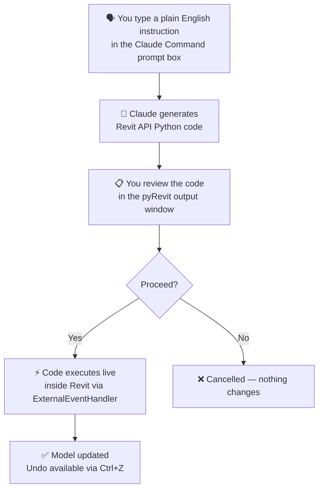
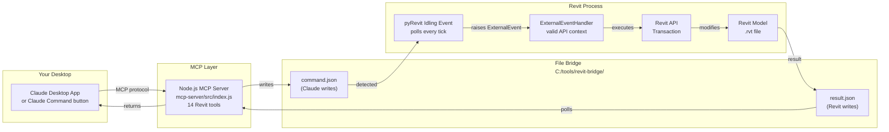
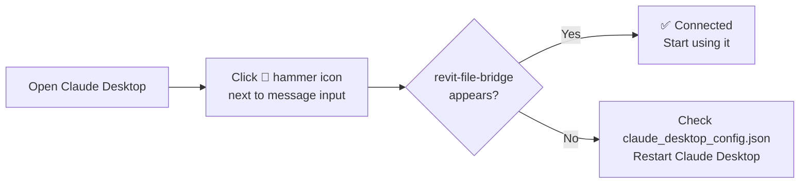

<div align="center">

# ClaudeRevit

### Control Autodesk Revit with plain English — powered by Claude AI

[](https://github.com/eirannejad/pyRevit)
[](https://www.autodesk.com/products/revit)
[](https://anthropic.com)
[](https://nodejs.org)
[](LICENSE)

**Type _"Create a 5-storey residential building with floor plans for each level"_ — Claude writes and executes the Revit API code live inside your model.**

</div>

---

## What Is This?

ClaudeRevit is a pyRevit extension + MCP server that connects Autodesk Revit to Claude (Anthropic's AI). Instead of writing Revit API scripts, you describe what you want in plain English — Claude generates the code and executes it directly inside Revit.

Everything is undoable with **Ctrl+Z**. No scripting knowledge required.

---

## The 10 Buttons

| # | Button | What it does |
|---|---|---|
| 1 | **Start Listener** | Arms Revit — begins watching for Claude commands |
| 2 | **Stop Listener** | Disarms Revit — stops the bridge |
| 3 | **Claude Command** | Large prompt box → Claude generates code → runs live |
| 4 | **Build Model** | Describe a building → Claude creates levels, walls, floors, rooms |
| 5 | **Generate Views** | Auto-create floor plans, sections, elevations, 3D views |
| 6 | **Place Rooms** | Auto-place and name rooms from a description |
| 7 | **Make Schedule** | Generate any schedule (walls, rooms, doors, custom) |
| 8 | **Create Sheets** | Create drawing sheets with title blocks and placed views |
| 9 | **Model Audit** | Claude reads the full model and produces a BIM audit report |
| 10 | **Ask Claude** | Ask any Revit / BIM question with live model context |

---

## How It Works



---

## Architecture



> **Why the file bridge?** Revit's API can only be called from inside specific event handlers within the Revit process. External threads — including any MCP server — are blocked from direct API calls. The file bridge + ExternalEvent pattern is the officially-supported architecture for this.

---

## Requirements

Before you start, make sure these are installed:

| Software | Version | Download |
|---|---|---|
| Autodesk Revit | 2023 or later | Your Autodesk subscription |
| pyRevit | 5.0+ | [github.com/eirannejad/pyRevit](https://github.com/eirannejad/pyRevit/releases) |
| Node.js | 18+ | [nodejs.org](https://nodejs.org) |
| Claude Desktop | Latest | [claude.ai/download](https://claude.ai/download) |

You also need an **Anthropic API key** — get one free at [console.anthropic.com](https://console.anthropic.com).

---

## Installation — Step by Step

### ① Clone the repository

Open a terminal and run:

```bash
git clone https://github.com/PrasannaChaurasia/revit-connections-with-claude.git
cd revit-connections-with-claude
```

Or download the ZIP from the green **Code** button above and extract it.

---

### ② Copy the pyRevit extension

Copy the extension folder to pyRevit's Extensions directory:

```
FROM:  revit-connections-with-claude/
          └── extension/
                └── ClaudeRevit.extension/   ← copy this whole folder

TO:    C:\Users\<YourName>\AppData\Roaming\pyRevit\Extensions\
```

**Tip:** In Windows Explorer, paste this in the address bar to open the destination:
```
%APPDATA%\pyRevit\Extensions
```

After copying, the path should look like:
```
C:\Users\<YourName>\AppData\Roaming\pyRevit\Extensions\
    └── ClaudeRevit.extension\
            ├── lib\
            ├── config.json          ← you will create this in Step ③
            └── ClaudeRevit.tab\
                    └── Claude.panel\
                            └── 01_ClaudeCommand.pushbutton\
                            └── ...
```

---

### ③ Add your Anthropic API key

In the extension folder, find `config.example.json`:

```
ClaudeRevit.extension\config.example.json
```

Copy it and rename the copy to `config.json`:

```bash
# Windows
copy "ClaudeRevit.extension\config.example.json" "ClaudeRevit.extension\config.json"
```

Open `config.json` in any text editor and paste your API key:

```json
{
  "anthropic_api_key": "sk-ant-api03-YOUR-KEY-HERE",
  "model": "claude-sonnet-4-6",
  "max_tokens": 1500,
  "notes": "NEVER commit this file. It is in .gitignore."
}
```

> **Where do I get the API key?**
> 1. Go to [console.anthropic.com](https://console.anthropic.com)
> 2. Sign in → API Keys → Create Key
> 3. Copy the key (starts with `sk-ant-api03-`)
> 4. Paste it into `config.json`

> **Important:** Each person who uses this needs their own API key. Never share your key.

---

### ④ Create the bridge directory

The file bridge needs a folder to exchange commands between Claude and Revit.

```bash
# Windows Command Prompt or PowerShell
mkdir C:\tools\revit-bridge
```

Or create it manually in Windows Explorer at `C:\tools\revit-bridge`.

---

### ⑤ Install MCP server dependencies

```bash
cd revit-connections-with-claude/mcp-server
npm install
```

This installs the MCP SDK that Claude Desktop uses to communicate with the server. It takes about 10 seconds.

---

### ⑥ Configure Claude Desktop

Open this file in a text editor (create it if it doesn't exist):

```
C:\Users\<YourName>\AppData\Roaming\Claude\claude_desktop_config.json
```

Paste this content, replacing `<YourName>` and the path with where you cloned the repo:

```json
{
  "mcpServers": {
    "revit-file-bridge": {
      "command": "node",
      "args": ["C:/revit-connections-with-claude/mcp-server/src/index.js"],
      "env": {
        "BRIDGE_DIR": "C:\\tools\\revit-bridge",
        "REVIT_TIMEOUT": "15000"
      }
    }
  }
}
```

> **Tip:** Use forward slashes in `args` but double backslashes in `env` for `BRIDGE_DIR`.

---

### ⑦ Reload pyRevit and activate the listener

1. Open Revit with any project file
2. Go to the **pyRevit** tab in the Revit ribbon
3. Click **Reload** (top-left of the pyRevit tab)
4. The **ClaudeRevit** tab will appear in the ribbon
5. Click **Start Listener** — a confirmation alert will appear
6. Revit is now ready

---

### ⑧ Restart Claude Desktop

Close Claude Desktop completely and reopen it. It will load the MCP server on startup.

To verify the connection:
- Open Claude Desktop
- Click the **hammer icon** (🔨) next to the message box
- You should see **revit-file-bridge** listed with 14 tools

---

### ✅ You are ready

Click **Claude Command** in the ClaudeRevit tab, type your instruction, and press **Run with Claude**.

---

## Verification — Check Claude Desktop Is Connected



In Claude Desktop, the hammer icon shows all active MCP tools. You should see tools like `revit_get_model_info`, `revit_create_levels`, etc. If you see them, everything is connected.

---

## Usage Examples

### Claude Command button (in Revit)

Type these in the **Claude Command** prompt box:

```
Create 5 storeys at 4m spacing starting at 0m
```

```
Build a 12m x 8m rectangular floor plan on Level 1
with 200mm concrete walls and a 150mm concrete floor
```

```
Create sheets A101 through A115 with A1 title block.
Place one floor plan view per level on each sheet.
```

```
Rename all rooms on Level 0 with prefix GF-
and all rooms on Level 1 with prefix L1-
```

```
Create a room schedule showing:
Name, Number, Area (m²), Level, Department
```

```
5-storey residential building:
- Ground floor: lobby 8x6m, 2 lifts, bin store
- Floors 1-4: 4 apartments each (2-bed 65sqm, 1-bed 45sqm)
- Roof: plant room + terrace
Add floor plan views for each level.
```

### Claude Desktop (via MCP — no button click needed)

Once the Listener is running in Revit, type directly in Claude chat:

```
What does my Revit model currently have?
```
```
Create 3 levels at 3m, 6m, 9m
```
```
List all rooms and their floor areas
```

---

## Troubleshooting

| Problem | Likely Cause | Fix |
|---|---|---|
| ClaudeRevit tab missing | pyRevit not reloaded | pyRevit tab → Reload |
| "Claude API error" | Wrong or missing API key | Check `config.json` — key must start with `sk-ant-` |
| "Timeout waiting for Revit" | Listener not running | Click **Start Listener** first |
| Prompt box opens but typing doesn't work | Focus issue | Click inside the text box once, then type |
| Code runs but model unchanged | Python error in generated code | Check pyRevit output window for error details |
| MCP not connected in Claude Desktop | Config not saved or wrong path | Edit `claude_desktop_config.json`, restart Claude Desktop |
| `revit-file-bridge` not in hammer menu | Claude Desktop not restarted | Fully close and reopen Claude Desktop |

---

## Sharing This With Another Person

Anyone can install and use this. Each person needs:

1. Clone or download this repository
2. Copy `ClaudeRevit.extension` to their `%APPDATA%\pyRevit\Extensions\`
3. Create `config.json` with **their own Anthropic API key**
4. Create `C:\tools\revit-bridge\`
5. Run `npm install` in the `mcp-server` folder
6. Add the server to their `claude_desktop_config.json`
7. Reload pyRevit → click Start Listener → restart Claude Desktop

The only cost is the Anthropic API usage — roughly $0.01–0.05 per command depending on complexity.

---

## File Structure

```
revit-connections-with-claude/
│
├── extension/
│   └── ClaudeRevit.extension/
│       ├── lib/
│       │   ├── claude_client.py          ← Claude API caller (shared by all buttons)
│       │   └── command_dispatcher.py     ← 14 Revit API action handlers
│       ├── config.example.json           ← Template — copy to config.json, add key
│       ├── config.json                   ← YOUR KEY — gitignored, never committed
│       └── ClaudeRevit.tab/
│           └── Claude.panel/
│               ├── 00_StartListener.pushbutton/    ← icon.png + script.py
│               ├── 00_StopListener.pushbutton/
│               ├── 01_ClaudeCommand.pushbutton/    ← WPF prompt + code gen + exec
│               ├── 02_BuildModel.pushbutton/
│               ├── 03_GenerateViews.pushbutton/
│               ├── 04_PlaceRooms.pushbutton/
│               ├── 05_MakeSchedule.pushbutton/
│               ├── 06_CreateSheets.pushbutton/
│               ├── 07_ModelAudit.pushbutton/
│               └── 08_AskClaude.pushbutton/
│
├── mcp-server/
│   ├── src/
│   │   └── index.js                      ← Node.js MCP server, 14 Revit tools
│   ├── package.json
│   └── package-lock.json
│
├── .gitignore                            ← config.json excluded
└── README.md
```

---

## Technical Notes

### IronPython 2.7
pyRevit scripts run in IronPython 2.7 (Python 2 syntax). All generated code uses `.format()` instead of f-strings, and all Revit API patterns are Python 2 compatible.

### Revit API Threading
The Revit API cannot be called from external threads. This is why the file bridge + ExternalEvent pattern is used — commands are queued and executed inside Revit's own event loop via the `Idling` event handler.

### Revit Units
All Revit API distances are in **decimal feet**. The scripts convert automatically: `1 metre = 3.28084 ft`, `1 mm = 1/304.8 ft`. You can always type in metres — Claude handles the conversion.

### Undo
Every model modification is wrapped in a `Transaction`, which means every action is fully undoable with **Ctrl+Z** in Revit.

---

## Author

**Prasanna Chaurasia**  
Architectural Designer & BIM Specialist  
Urban Matrix — Manchester, UK  
[github.com/PrasannaChaurasia](https://github.com/PrasannaChaurasia)

---

<div align="center">

*Built to make BIM faster — not just smarter.*

</div>
