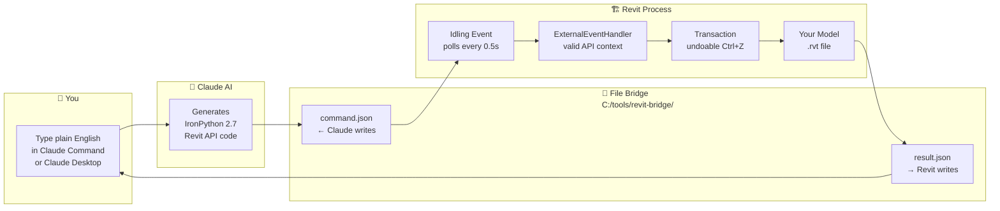

<div align="center">


# Control Revit with Plain English

<p>


</p>

**ClaudeRevit** adds an AI tab to Autodesk Revit.<br/>
Type _"Create a 5-storey residential building with floor plans for each level"_ — Claude writes and executes the Revit API code live inside your model.<br/>
Every action is undoable with Ctrl+Z.

<br/>

```
  You type:   "5 storeys at 4m spacing, rectangular 15×10m plan, 200mm walls"
              ↓
  Claude:     Writes IronPython code targeting the Revit API
              ↓
  pyRevit:    Executes inside Revit's ExternalEventHandler
              ↓
  Revit:      Levels, walls, floor geometry created in your model ✓
```

</div>

---

## The ClaudeRevit Tab — 10 Buttons

| Button | What it does | Status |
|---|---|---|
| ▶ **Start Listener** | Arms Revit — opens the file bridge for Claude Desktop | Ready |
| ■ **Stop Listener** | Closes the bridge | Ready |
| ✦ **Claude Command** | Chat-style prompt box → code generation → live execution | Ready |
| ⬜ **Build Model** | Plain-English building description → walls, floors, levels | Ready |
| ⊞ **Generate Views** | Auto-create floor plans, sections, elevations, 3D views | Ready |
| ⊡ **Place Rooms** | Auto-place and name rooms from a text description | Ready |
| ≡ **Make Schedule** | Any schedule in plain English — walls, rooms, doors, sheets | Ready |
| ⬒ **Create Sheets** | Title blocks, sheet numbers, placed views, all automated | Ready |
| ◎ **Model Audit** | Claude reads the full model and writes a structured BIM report | Ready |
| ◌ **Ask Claude** | Ask any Revit or BIM question with your live model as context | Ready |

---

## How It Works



> **Why the file bridge?**  
> The Revit API is single-threaded. It can only be called from inside Revit's own event loop — never from external processes. The file bridge + `ExternalEvent` is the officially documented pattern for this.

---

## System Requirements

| Software | Minimum Version | Where to get it |
|---|---|---|
| Autodesk Revit | 2023 | Your Autodesk subscription |
| pyRevit | 5.0 | [github.com/eirannejad/pyRevit/releases](https://github.com/eirannejad/pyRevit/releases) |
| Node.js | 18 LTS | [nodejs.org](https://nodejs.org) |
| Claude Desktop | Latest | [claude.ai/download](https://claude.ai/download) |
| Anthropic API key | — | [console.anthropic.com](https://console.anthropic.com) → API Keys |

**Cost:** Roughly £0.01–0.05 per command depending on complexity. No subscription required beyond the API.

---

## Installation

### Step ① — Get the files

```bash
git clone https://github.com/PrasannaChaurasia/revit-connections-with-claude.git
```

Or click the green **Code → Download ZIP** button above and extract anywhere.

---

### Step ② — Copy the pyRevit extension

Open Windows Explorer and paste this into the address bar:
```
%APPDATA%\pyRevit\Extensions
```

Copy the entire `ClaudeRevit.extension` folder from the repo into that directory:

```
Copy:  revit-connections-with-claude\extension\ClaudeRevit.extension\

Into:  C:\Users\<YourName>\AppData\Roaming\pyRevit\Extensions\
```

The result should be:
```
C:\Users\<YourName>\AppData\Roaming\pyRevit\Extensions\
    └── ClaudeRevit.extension\
            ├── lib\
            ├── config.example.json
            └── ClaudeRevit.tab\
```

---

### Step ③ — Add your API key

Inside the extension folder, find `config.example.json`. Copy it and rename to `config.json`:

```
config.example.json  →  config.json
```

Open `config.json` in Notepad and paste your Anthropic API key:

```json
{
  "anthropic_api_key": "sk-ant-api03-YOUR-KEY-HERE",
  "model": "claude-sonnet-4-6",
  "max_tokens": 1500
}
```

> **Get your key:**  
> 1. Sign in at [console.anthropic.com](https://console.anthropic.com)  
> 2. Go to **API Keys** → **Create Key**  
> 3. Copy the key (starts with `sk-ant-api03-`)  
> 
> **Never commit `config.json` to GitHub. It is already listed in `.gitignore`.**

---

### Step ④ — Create the bridge folder

```
Create this folder:   C:\tools\revit-bridge\
```

In Windows Explorer: navigate to `C:\tools\`, right-click → New Folder → name it `revit-bridge`.

Or in PowerShell:
```powershell
New-Item -ItemType Directory -Path "C:\tools\revit-bridge"
```

---

### Step ⑤ — Install MCP server

Open a terminal in the repo folder and run:

```bash
cd revit-connections-with-claude\mcp-server
npm install
```

This takes about 10 seconds and installs the MCP SDK.

---

### Step ⑥ — Connect Claude Desktop

Open this file in Notepad (create it if it doesn't exist):

```
C:\Users\<YourName>\AppData\Roaming\Claude\claude_desktop_config.json
```

Add the MCP server entry. Replace `<FULL-PATH>` with the actual path to `index.js`:

```json
{
  "mcpServers": {
    "revit-file-bridge": {
      "command": "node",
      "args": ["C:/revit-connections-with-claude/mcp-server/src/index.js"],
      "env": {
        "BRIDGE_DIR": "C:\\tools\\revit-bridge",
        "REVIT_TIMEOUT": "15000"
      }
    }
  }
}
```

---

### Step ⑦ — Load the extension in Revit

1. Open Revit
2. Go to the **pyRevit** ribbon tab
3. Click **Reload** (top-left of the pyRevit tab)
4. The **ClaudeRevit** tab appears in the ribbon

---

### Step ⑧ — Start the listener and connect Claude Desktop

**In Revit:**
1. Click **Start Listener** in the ClaudeRevit tab
2. A confirmation dialog appears — Revit is now ready

**In Claude Desktop:**
1. Fully close Claude Desktop (right-click system tray icon → Quit)
2. Reopen Claude Desktop
3. Click the **🔨 hammer icon** next to the message input
4. You should see **revit-file-bridge** with 14 tools listed

---

### ✅ Ready — test it

Click **Claude Command** in the ClaudeRevit tab and type:

```
Create 3 levels named Ground Floor, First Floor, Second Floor at 0m, 4m, 8m
```

Claude will generate the code, show it for review, and execute it in your model.

---

## Using Claude Desktop to Control Revit

Once the Listener is running, open Claude Desktop and type directly:

| What you type | What happens in Revit |
|---|---|
| `What does my model have?` | Returns counts, levels, sheets |
| `Create 5 levels at 4m spacing` | Levels appear in model |
| `List all rooms and their areas` | Returns table of rooms |
| `Create a wall schedule with Type, Length, Area` | Schedule created in project |
| `Delete all views that start with "Copy"` | Views removed (use carefully) |

---

## Example Prompts for Claude Command

```
Create 5 storeys at 4m spacing starting at 0m elevation
```

```
Build a 15m × 10m rectangular floor plan on Level 1
with 200mm brick walls and a 150mm concrete floor slab
```

```
Create sheets A101 through A115 with A1 title block.
Place one floor plan view per level on each sheet.
Number them sequentially.
```

```
Rename all rooms on Level 0 with prefix "GF-" and
all rooms on Level 1 with prefix "L1-"
```

```
5-storey residential block:
- Ground floor: lobby 8×6m, 2 core lifts, bin store, cycle store
- Floors 1–4: 4 apartments per floor (2-bed 65m², 1-bed 45m²)
- Roof: plant room 6×4m + communal terrace
Add floor plan views for all levels and create a sheet for each.
```

```
Create a room schedule with Name, Number, Area (m²), Level, and Department.
Sort by Level then by Room Number.
Group by Level.
```

---

## How Claude Generates Safe Revit Code

Every generated script follows strict rules enforced in the system prompt:

| Rule | Why |
|---|---|
| No f-strings, use `.format()` | pyRevit runs IronPython 2.7 (Python 2) |
| All changes in `with revit.Transaction()` | Makes every action undoable with Ctrl+Z |
| Distances always converted to decimal feet | Revit internal unit is feet, not metres |
| `try/except` wrapping all operations | Errors surface as Revit alerts, not silent crashes |
| No `ok_btn` or `warn_icon` in `forms.alert()` | Not supported in this pyRevit version |

---

## Troubleshooting

| Symptom | Cause | Fix |
|---|---|---|
| ClaudeRevit tab missing | pyRevit not reloaded | pyRevit tab → Reload |
| "Cannot convert 1 to WindowStartupLocation" | Old script version | Pull latest from GitHub, reload pyRevit |
| "Claude API error: 401" | Wrong API key | Check `config.json` — key must start with `sk-ant-api03-` |
| Timeout waiting for Revit | Listener not running | Click **Start Listener** before sending commands |
| Revit laggy after Start Listener | Old version polled every frame | Latest version polls at 2×/sec — pull and reload |
| "categoryId is not valid for schedule" | OST_Sheets with CreateSchedule | Fixed in latest version — pull and reload |
| 🔨 hammer missing in Claude Desktop | Claude Desktop not restarted | Fully quit (system tray) and reopen |
| Hammer shows but revit-file-bridge missing | Config path wrong | Check `claude_desktop_config.json`, use forward slashes in `args` |
| Code runs but nothing changes | Missing bridge folder | Ensure `C:\tools\revit-bridge\` exists |

---

## What Else Can Be Added

**Planned features:**

| Feature | Description |
|---|---|
| **Architectural Audit** | Checks drawing conventions, room naming, wall types, sheet organisation against UK/global standards |
| **MEP Coordination Audit** | Flags spatial clashes, missing system connections, duct/pipe sizing |
| **Structural Audit** | Column grid consistency, beam sizing, structural level alignment |
| **NBS Specification Linker** | Links wall types and materials to NBS clauses |
| **IFC Export Checker** | Validates model against IFC4 LOD requirements before export |
| **COBie Readiness Report** | Checks which parameters are missing for COBie handover |
| **Drawing Issue Manager** | Creates revision clouds, updates revision tables, manages drawing status |
| **Clash Detection Summary** | Runs basic spatial checks and reports conflicts |
| **Parameter Bulk Editor** | Edit parameters across hundreds of elements at once using plain English |
| **Phasing Manager** | Assign elements to phases from a description |

---

## For Public / New Users — How to Install on Your System

Anyone can install this. You do not need programming experience. You need:

1. **Revit 2023+** with an active Autodesk licence
2. **pyRevit** (free) — install from [github.com/eirannejad/pyRevit/releases](https://github.com/eirannejad/pyRevit/releases)
3. **Node.js 18+** (free) — install from [nodejs.org](https://nodejs.org)
4. **Claude Desktop** (free app) — from [claude.ai/download](https://claude.ai/download)
5. **Anthropic API key** — [console.anthropic.com](https://console.anthropic.com) → sign up → API Keys → Create

Then follow Steps ① through ⑧ above. Each step has a clear terminal command or folder path.

**What it costs:** Only the Anthropic API usage — roughly 1–5p per command. No monthly fee.

**What it does NOT require:** Python knowledge, Revit API knowledge, scripting experience.

---

## Repository Structure

```
revit-connections-with-claude/
│
├── extension/
│   └── ClaudeRevit.extension/
│       ├── lib/
│       │   ├── claude_client.py        ← Calls Claude API, executes code
│       │   └── command_dispatcher.py   ← 14 Revit actions (read + write)
│       ├── config.example.json         ← Copy this → config.json, add key
│       └── ClaudeRevit.tab/
│           └── Claude.panel/
│               ├── 00_StartListener.pushbutton/
│               ├── 00_StopListener.pushbutton/
│               ├── 01_ClaudeCommand.pushbutton/   ← Chat-style prompt + exec
│               ├── 02_BuildModel.pushbutton/
│               ├── 03_GenerateViews.pushbutton/
│               ├── 04_PlaceRooms.pushbutton/
│               ├── 05_MakeSchedule.pushbutton/    ← Fixed OST_Sheets bug
│               ├── 06_CreateSheets.pushbutton/
│               ├── 07_ModelAudit.pushbutton/
│               └── 08_AskClaude.pushbutton/
│
├── mcp-server/
│   ├── src/
│   │   └── index.js                   ← Node.js MCP server, 14 tools
│   └── package.json
│
├── .gitignore                         ← config.json excluded
└── README.md
```

---

## Author

**Prasanna Chaurasia**  
Architectural Designer & BIM Specialist  
Urban Matrix — Manchester, UK  
[github.com/PrasannaChaurasia](https://github.com/PrasannaChaurasia)

---

<div align="center">

*Revit speaks English now.*

</div>
