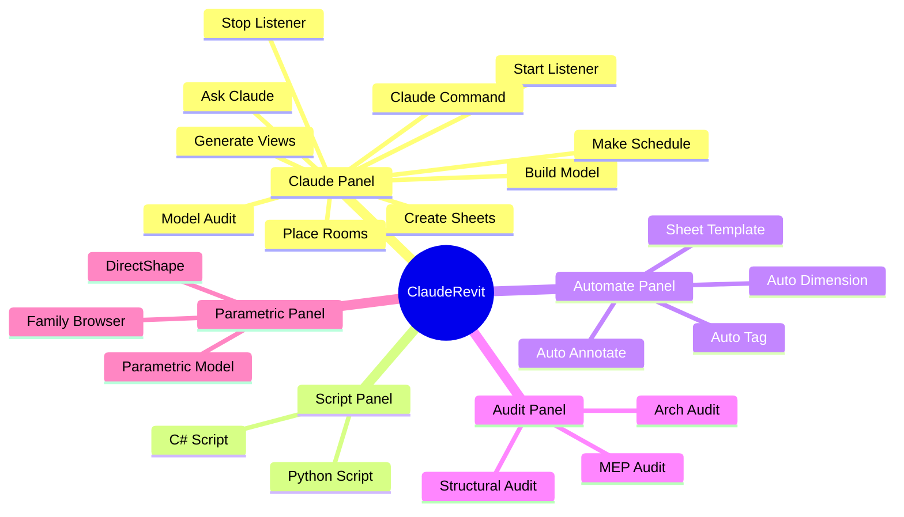
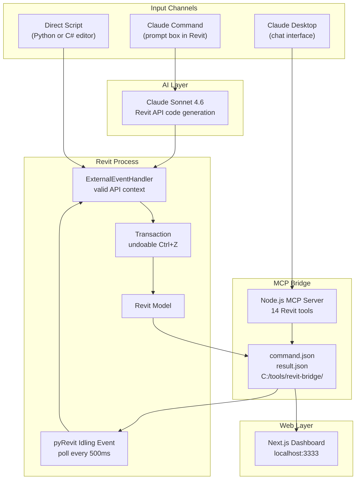
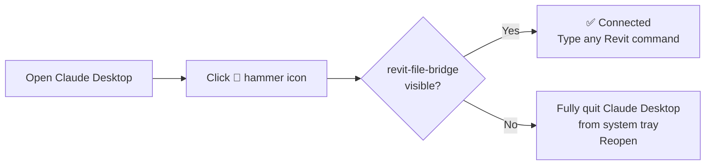

<div align="center">


# The AI-Powered BIM Platform for Revit

<p>


</p>

**Type. Click. Done.**  
Control every aspect of Revit in plain English — model creation, drawing production, multi-discipline auditing, parametric geometry, family management, and live dashboards.

</div>

---

## Five Panels. Twenty Buttons. Full Revit Control.



---

## Panel Reference

### Claude Panel — Core AI Control
| Button | Description |
|---|---|
| ▶ **Start Listener** | Arms Revit for Claude Desktop commands. Creates bridge folder automatically. Throttled to 2× per second (no lag). |
| ■ **Stop Listener** | Closes the bridge and deactivates the listener. |
| ✦ **Claude Command** | Chat-style dark prompt box → Claude generates Revit API code → review → execute. Ctrl+Enter to run. |
| ⬜ **Build Model** | Plain-English building description → walls, floors, levels, rooms created automatically. |
| ⊞ **Generate Views** | Create floor plans, sections, elevations, 3D views, ceiling plans from a description. |
| ⊡ **Place Rooms** | Auto-place and name rooms with numbers, departments, and area targets. |
| ≡ **Make Schedule** | Any schedule from plain English — walls, rooms, doors, windows, sheets, custom categories. |
| ⬒ **Create Sheets** | Create numbered sheets with title blocks, auto-placed views, and project info populated. |
| ◎ **Model Audit** | Full BIM audit: counts, health report, issues ranked by severity. |
| ◌ **Ask Claude** | Ask any Revit or BIM question with your live model as context. |

### Script Panel — Direct Code Execution
| Button | Description |
|---|---|
| **Python Script** | Full-screen code editor (Consolas font, dark theme). Write IronPython 2.7 directly or press **Ask Claude** to generate from a description. Ctrl+Enter to run. |
| **C# Script** | Write and compile C# in-memory via `CSharpCodeProvider`. Full .NET 4.x + Revit API. Claude can generate. |

### Automate Panel — Drawing Production
| Button | Description |
|---|---|
| **Auto-Dimension** | Place dimension strings on horizontal, vertical, or all walls in the active floor plan view automatically. |
| **Auto-Tag** | Place room tags, door marks, window marks, wall tags, and furniture tags across the active view in one click. |
| **Auto-Annotate** | Show grid bubbles in plan/section views, show level markers in sections, reveal crop regions, report views missing scales, report unplaced views. |
| **Sheet Template** | Dialog to set project info, sheet numbers, title block, count, and auto-place one unplaced view per sheet. |

### Audit Panel — Multi-Discipline Quality Checks
| Button | Description |
|---|---|
| **Arch Audit** | Architectural audit with region selector: spaces, accessibility, annotation completeness, BIM data quality, code compliance (UK/EU/US/International). |
| **MEP Audit** | MEP audit: HVAC duct coverage, electrical lighting ratios, plumbing fixture coverage, missing MEP sheets, coordination flags. Region-aware (CIBSE/ASHRAE/EN). |
| **Structural Audit** | Structural audit: column grid naming, beam/column mark completeness, type rationalisation, storey height checks, structural drawing completeness. (Eurocode/US/International). |

### Parametric Panel — Computational Design
| Button | Description |
|---|---|
| **Parametric Model** | Describe parametric geometry — sine wave walls, twisted towers, patterned facades, column grids. Claude generates the mathematical code. |
| **DirectShape** | Push any geometry into Revit as a DirectShape element (box, cylinder, pyramid, sphere, extruded profile, or custom). Fastest way to place non-family geometry. |
| **Family Browser** | Browse all loaded families, search by name, view type details and instance counts, place a selected type at the project origin. |

---

## Architecture



---

## Requirements

| Software | Minimum | Notes |
|---|---|---|
| Autodesk Revit | 2023 | Your Autodesk subscription |
| pyRevit | 5.0 | [github.com/eirannejad/pyRevit](https://github.com/eirannejad/pyRevit/releases) |
| Node.js | 18 LTS | [nodejs.org](https://nodejs.org) |
| Claude Desktop | Latest | [claude.ai/download](https://claude.ai/download) |
| Anthropic API key | — | [console.anthropic.com](https://console.anthropic.com) |

**Optional for dashboard:** Node.js + `npm install` in `/dashboard`

---

## Installation — 8 Steps

### ① Clone

```bash
git clone https://github.com/PrasannaChaurasia/revit-connections-with-claude.git
```

### ② Copy extension to pyRevit

Paste in Windows Explorer address bar: `%APPDATA%\pyRevit\Extensions`

Copy `extension/ClaudeRevit.extension` into that folder.

### ③ Add your API key

Copy `config.example.json` → `config.json` inside the extension folder. Add your key:

```json
{
  "anthropic_api_key": "sk-ant-api03-YOUR-KEY-HERE",
  "model": "claude-sonnet-4-6",
  "max_tokens": 1500
}
```

### ④ Create bridge folder

```
C:\tools\revit-bridge\
```

### ⑤ Install MCP server

```bash
cd mcp-server && npm install
```

### ⑥ Configure Claude Desktop

File: `%APPDATA%\Claude\claude_desktop_config.json`

```json
{
  "mcpServers": {
    "revit-file-bridge": {
      "command": "node",
      "args": ["C:/revit-connections-with-claude/mcp-server/src/index.js"],
      "env": {
        "BRIDGE_DIR": "C:\\tools\\revit-bridge",
        "REVIT_TIMEOUT": "15000"
      }
    }
  }
}
```

### ⑦ Reload pyRevit → Click Start Listener

1. Revit → pyRevit tab → **Reload**
2. **ClaudeRevit** tab appears
3. Click **Start Listener**

### ⑧ Restart Claude Desktop

Fully quit (system tray → Quit) and reopen. The 🔨 hammer icon will show `revit-file-bridge` with 14 tools.

---

## Verifying Claude Desktop Connection



Check logs at: `%APPDATA%\Claude\logs\mcp-server-revit-file-bridge.log`

---

## Optional: Web Dashboard

```bash
cd dashboard
npm install
npm run dev
```

Open `http://localhost:3333` — shows live model data from the last Revit command result.

---

## Multi-Language Support

| Language | Access Level | How |
|---|---|---|
| **IronPython 2.7** | Full Revit API | pyRevit scripts — all buttons use this |
| **Python 3** | Full Revit API | Python Script button (if CPython engine available) |
| **C#** | Full Revit API + .NET | C# Script button via `CSharpCodeProvider` |
| **JavaScript/Node.js** | Via file bridge | MCP server — Claude Desktop integration |
| **Next.js** | Model data display | Dashboard — reads from result.json |
| **Dynamo** | Full parametric API | Use Parametric Model button to generate scripts |
| **DirectShape API** | Custom geometry | DirectShape button |

---

## Audit Standards Supported

| Panel | UK | EU | US | International |
|---|---|---|---|---|
| **Arch Audit** | BS EN ISO 19650, Part B/L/M | EN standards, Eurocodes | IBC, ADA | Best practice |
| **MEP Audit** | CIBSE, BS 7671 | EN 15232, EN 12831 | ASHRAE 90.1, NEC | Best practice |
| **Structural Audit** | Eurocode + UK NA, BS 8110 | Eurocode 2/3/4 | AISC, ACI 318 | Best practice |

---

## Troubleshooting

| Issue | Fix |
|---|---|
| Tab missing after reload | Right-click pyRevit tab → Reload pyRevit |
| WPF TypeError on any button | Pull latest — fixed in v2+ |
| "Schedule categoryId invalid" | Pull latest — OST_Sheets fix applied |
| Revit laggy with listener | Pull latest — throttled to 500ms |
| Hammer not in Claude Desktop | Fully quit from system tray, reopen |
| Bridge timeout | Ensure Start Listener is active first |
| DirectShape not visible | Check category visibility in View → Visibility/Graphics |
| C# compile error | Verify class is named `RevitScript`, method named `Execute` |

---

## For New Users — Complete Install in 10 Minutes

You need: Revit licence, pyRevit (free), Node.js (free), Claude Desktop (free), Anthropic API key.

Total cost per command: ~£0.01–0.05. No subscription. No monthly fee.

Full walkthrough in the [Installation section](#installation--8-steps) above.

---

## Planned Features

| Feature | Description |
|---|---|
| Auto-dimensioning in sections | Running dimensions on sections and elevations |
| NBS Specification linker | Link wall/floor types to NBS clauses |
| COBie readiness report | Check parameter completeness for handover |
| Drawing issue manager | Revision clouds, status stamps, issue registers |
| IFC export validator | Check model against IFC4 LOD before export |
| Rhino.Inside integration guide | Pipe Grasshopper parametric geometry into Revit |
| Clash detection summary | Basic spatial checks across disciplines |

---

## Repository Structure

```
revit-connections-with-claude/
├── extension/ClaudeRevit.extension/
│   ├── lib/
│   │   ├── claude_client.py       ← Claude API, code exec, context builder
│   │   ├── command_dispatcher.py  ← 14 MCP bridge actions
│   │   └── wpf_helper.py         ← Shared WPF components (dark theme, gold)
│   ├── config.example.json        ← Copy → config.json, add key
│   └── ClaudeRevit.tab/
│       ├── Claude.panel/          ← 10 core AI buttons
│       ├── Script.panel/          ← Python + C# editors
│       ├── Automate.panel/        ← Dimension, Tag, Annotate, Sheets
│       ├── Audit.panel/           ← Arch, MEP, Structural audits
│       └── Parametric.panel/      ← Parametric, DirectShape, Families
├── mcp-server/src/index.js        ← Node.js MCP server (14 tools)
├── dashboard/                     ← Next.js live model dashboard
├── .gitignore
└── README.md
```

---

## Author

**Prasanna Chaurasia**  
Architectural Designer & BIM Specialist · Urban Matrix · Manchester, UK  
[github.com/PrasannaChaurasia](https://github.com/PrasannaChaurasia)

---

<div align="center">
<sub>20 buttons · 5 panels · Full Revit API · Multi-discipline auditing · Parametric geometry · Live dashboard</sub>
</div>
